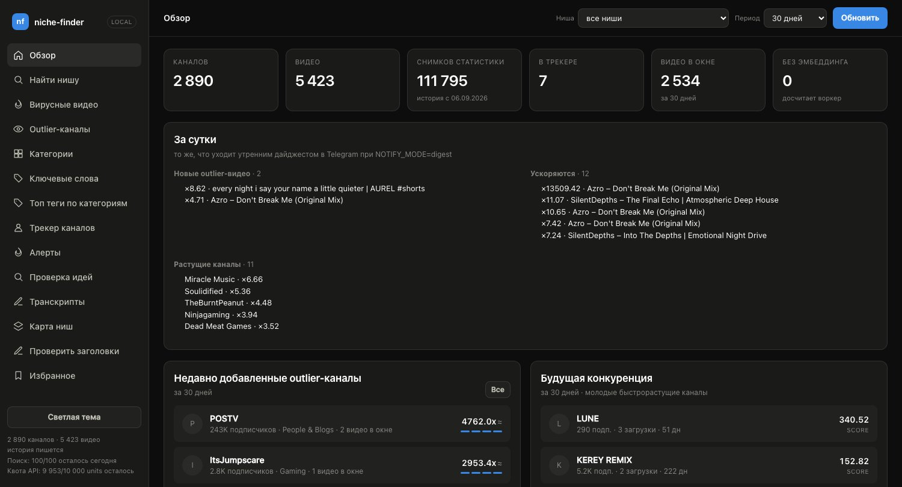
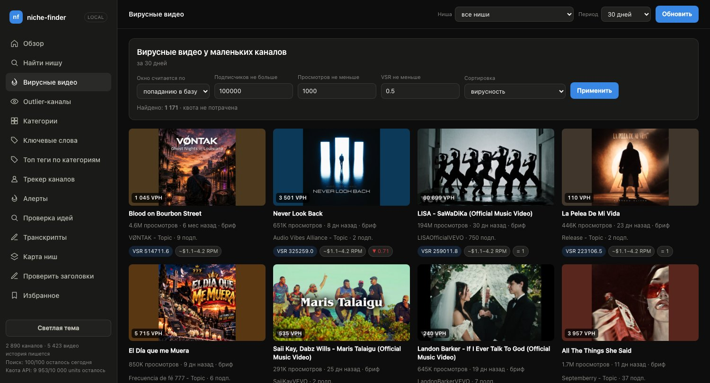
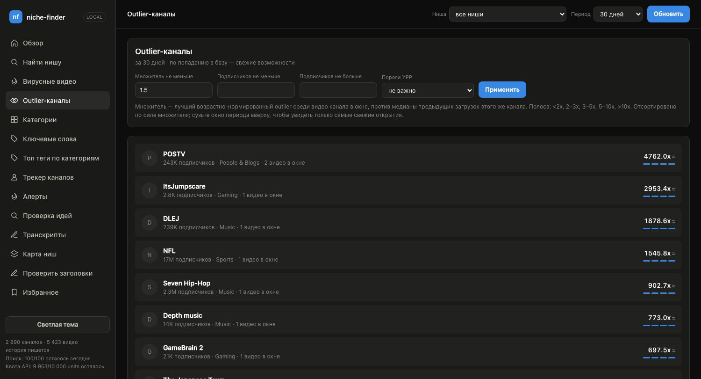
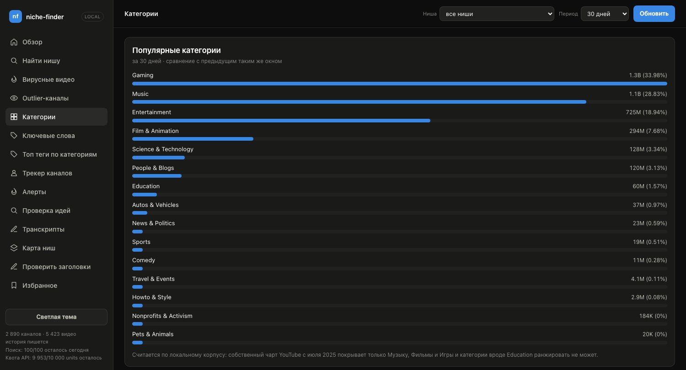
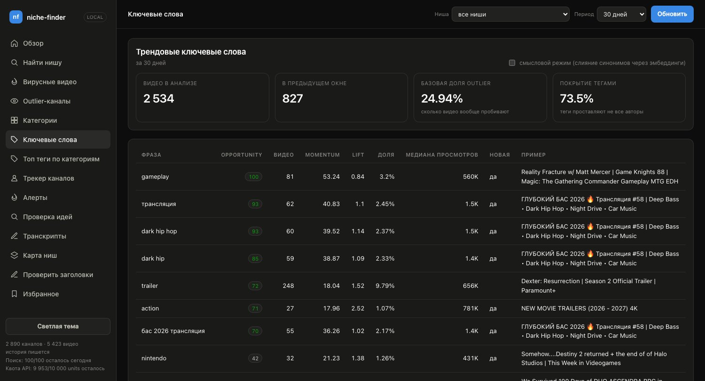
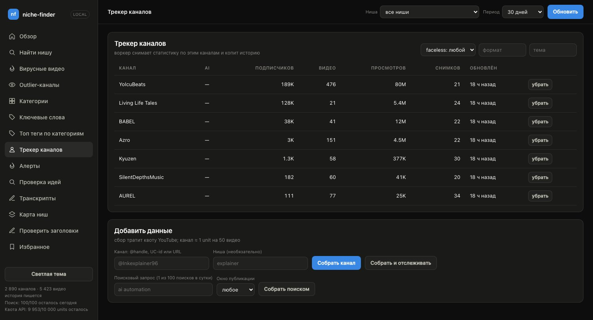
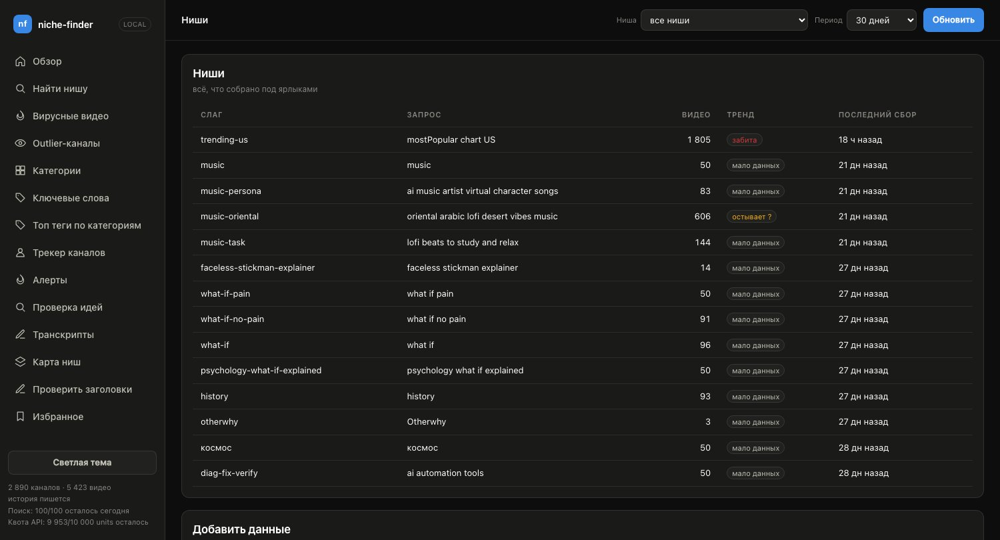
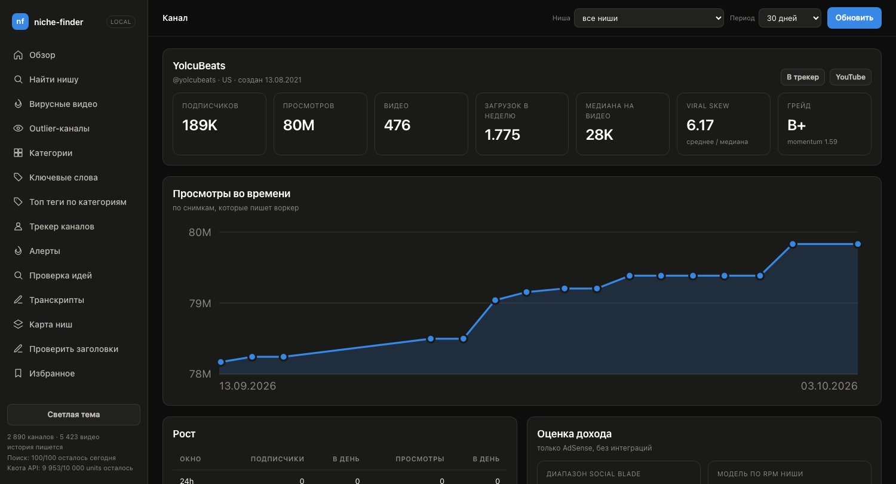
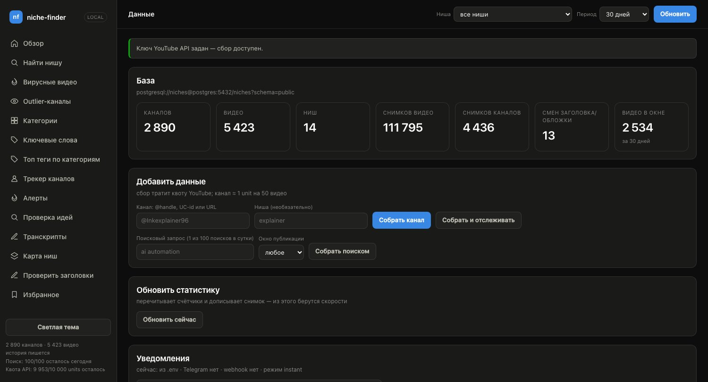

# frontend

[](https://github.com/pandich93/youtube-niche-finder/actions/workflows/ci.yml)
[](index.html)
[](app.js)
[](../LICENSE)

The dashboard for niche-finder — the same thing NexLev shows in its own
Niche Finder, but backed by your local database and with no subscription.

```bash
cd youtube-niche-finder
docker compose build            # picked up fastapi + uvicorn
docker compose up -d web worker
open http://localhost:8080
```

Without Docker (the same dashboard, the same `frontend/`, reads files from
right here):

```bash
make local-install   # once: venv + backend dependencies
make dev             # uvicorn api:app --reload on http://localhost:8080
```

More on running without Docker —
[backend/README.md](../backend/README.md#running-without-docker).

## How it's built

No build step: plain ES modules, no npm, no `node_modules`, no build. Edit a
file and see it after a page reload — the folder is mounted into the
container read-only, no image rebuild needed.

| File | What's inside |
|---|---|
| `index.html` | shell: sidebar, header with global filters, screen container |
| `styles.css` | dark and light themes, components |
| `ui.js` | formatters, tooltips, toasts, and components (cards, tables, bars, chart) |
| `app.js` | entry point: theme, global filters, footer, first render |
| `router.js` | hash routing: route table, active menu item, loading/error state |
| `shared.js` | shared by screens: `#view`, period labels, the collect form, the quota footer, the niche overview block |
| `hook_view.js` | the hook-score result card shared by the Transcripts and Title check screens |
| `screens/*.js` | one file per screen (`overview.js`, `find.js`, …, `channel.js`, `niche.js`) |
| `tests/test_smoke.py` | opens every screen in headless Chromium against a seeded backend (`make frontend-test`) |

Data comes from `backend/api.py` (a shim over `interfaces/http/api.py`,
FastAPI), which calls exactly the same use cases as the MCP server. There's
no logic in the frontend — every metric is computed on the backend, the UI
just displays it.

## Screens

The "Niche" and "Period" global filters in the header apply to every screen
and are remembered in the browser. The UI labels themselves are in Russian;
the sections below follow the sidebar order.

### Overview

Everything at once, in one call to `/api/overview`: outlier channels,
upcoming competition, categories, keywords, viral videos. On top, "За сутки"
(`/api/digest`) — the last 24 hours as the morning digest would send them:
new outliers, accelerating videos, rising channels, repackaging, gone items.



### Find a niche (`#/find`)

Semantic search over the already-collected corpus via title+description
embeddings (`/api/search`) — free, no YouTube quota. The topic is optional;
without it the screen is a plain browse by the chosen sort. Filters: minimum
outlier multiplier, max subscribers, estimated RPM range, video length, and
Shorts (any / exclude / only); they're remembered in the browser, with a
"reset filters" button for when a stale filter hides everything. RPM is an
estimate from the YouTube category, not a measured payout, so it tops out
around $8; cards show it as a range (half to double the model's value, since
published RPM estimates disagree by up to 7x) and the filter compares the
middle of that range. A "YPP thresholds" filter keeps only channels past
the YouTube Partner Program bars they visibly meet (not a monetization
status). A quota-spending collection form sits underneath.

### Viral videos

Videos from small channels, with filters (subscribers, views, VSR, publish
window) and a funnel underneath: shows exactly which threshold filtered out
the results, instead of just an empty list.



### Outlier channels

The best age-adjusted multiplier among a channel's videos in the window,
against the median of its previous uploads. Strength bands: <2x, 2–3x,
3–5x, 5–10x, >10x. Can be narrowed to channels past the visible YPP
thresholds.



### Categories

YouTube category rankings over a period, with a share shift against the
previous window of the same length — rank by views or by channel count.



### Keywords

Trending phrases: momentum, lift, trendScore, share of videos, and median
views, with an example video for each phrase.



### Top tags by category (`#/tags`)

Whole author-supplied tags (not split into words) ranked per YouTube
category over the period (`/api/tags/top-by-category`): video count, share,
outlier lift, median views, and an example title. A lift above 1.5 means the
tag actually correlates with breakouts rather than just being popular.

### Channel tracker

The watchlist the worker builds snapshot history for, plus forms to add a
channel (by handle/URL) or collect by search query. The list can be filtered
by AI labels (faceless, content format, topic) once background enrichment
has classified the channels.



### Alerts (`#/alerts`)

The alert events of your watchlist (`/api/events`) — the same ones Telegram
or a webhook gets: outliers, acceleration, title changes, a channel breaking
its silence, and a channel or video that disappeared. Filter by type or "only
new", and mark everything read. Zero quota.

### Idea checker (`#/ideas`)

One idea per line → a verdict for each against your own corpus
(`POST /api/ideas/check`): *free*, *covered recently*, *proven demand*, or
*flopped*. Thresholds (recent window in days, proven/flop outlier cut-offs)
are adjustable; every idea expands to the matching videos, and the result
can be exported to CSV client-side.

### Transcripts (`#/transcripts`)

A ready transcript has a "Крючок" button: the first ~30 seconds scored 0-100 by text rules
(question, number, promise, intrigue, "you", first sentence, pace, minus filler), with an
opt-in LLM review checkbox; above the queue, a niche benchmark of outliers' vs ordinary
hooks ("мало данных: N из 10" until there are enough transcripts). The rendering is shared
with the title screen in `hook_view.js`.

Transcripts are never downloaded automatically — this screen is the manual
queue. Request one by video ID (`POST /api/transcripts/request`), paste the
text copied from YouTube (with or without timestamps) into a pending item
(`POST /api/transcripts/{id}/save`), and re-index ready ones. Tabs split the
queue into pending / ready / error (`/api/transcripts/queue`). The search box
on top is hybrid vector + full-text search over saved transcripts
(`/api/transcripts/search`).

### Niche map (`#/clusters`)

Channels clustered by the embeddings of their videos — niches found without
defining them by hand (`/api/niche-clusters`). Each cluster shows its name
and description, channel count, median outlier score, total velocity
(views/hour), faceless share, and how many competitors have over 100k
subscribers. "Recompute" (`POST /api/niche-clusters/recompute`) re-runs
k-means and names clusters via the LLM (tags-based fallback without one).

### Title check (`#/titles`)

A second card, "Проверить вступление": paste your intro (the first 20-30 seconds of a
script), get the score, penalties and tips (`POST /api/hooks/score`); the text is never
stored or sent to an LLM, and the niche comparison uses the global filter.

Needs a niche selected in the global filter. **Score** (`POST
/api/titles/score`) rates candidate titles 0–100 against the niche's own
patterns: length, numbers, matched title patterns, near-duplicates of
already published videos, plus LLM strengths/risks and an improved variant
when an LLM is configured. **Generate** (`POST /api/titles/suggest`) drafts
eight titles for a topic and requires `LLM_PROVIDER`.

### Saved (`#/saved`)

The swipe file: videos and channels saved from the extension panel, with a
snapshot of their metrics at save time, folder, and note (`/api/saved`);
items can be removed from here.

### Repackaging (`#/packaging`)

Title and thumbnail swaps after publishing (`/api/packaging`), newest first:
old vs new title, or the archived "before" and "after" thumbnails side by side
(`/api/thumbnails/{videoId}/{capturedAt}.jpg`), with views per hour in the 48
hours before vs after the swap. Filters: what changed, tracked channel; the
period comes from the top bar. Thumbnails are fingerprinted by the worker for
tracked channels only, so their history starts when a channel is tracked.

### Sponsors (cards on `#/niche/<slug>` and `#/channel/<id>`)

"Спонсоры ниши" (`/api/niches/{slug}/sponsors`) and "Спонсоры канала"
(`/api/channels/{id}/sponsors`): the share of videos with a named sponsor or
promo code, top brands, affiliate links listed apart, and average views with
and without a sponsor. Always labelled a lower bound: only what is written in
video descriptions. Shares are computed over the videos the worker has already
scanned, and the card says how many that is.

### Brief (`#/brief/<videoId>`)

Opened from the "бриф" link on any video card (or the extension's "Бриф"
button). Builds a brief for your own video from one outlier
(`POST /api/briefs`): the source's numbers, its hook from a pasted transcript,
niche title patterns and best time, whether the topic is already covered
(without the source itself), title candidates and similar videos as thumbnail
references. It opens as a free preview without an LLM; "Добавить LLM-разбор"
adds the angle and title candidates, "Сохранить в черновики" stores it as a
draft linked to the source and queues a missing transcript. Parts that could
not be built are listed with the reason instead of being faked.

### Metadata review (`#/metadata`)

Checks a draft title/description/tags against your own corpus (`POST
/api/metadata/review`) — no single "SEO score", only individual signals, each
with its own sample size and an *ok / worth fixing / sample too small*
verdict. Also shows the niche's structural patterns with lift and whether the
draft has them, and near-duplicate topics already in the database. Drafts
can be saved (`POST /api/drafts`) and later linked to the published video ID
(`POST /api/drafts/{id}/link`) to check whether the prediction held up.

### Niches

Everything collected under user-defined labels (a slug plus the original
query), with video counts and the last collection time for each niche.



### Niche (`#/niche/<slug>`)

Opened from the Niches list. Summary tiles (videos, channels, median
multiplier, median views, viral skew), the share of channels that look like a
template conveyor (`/api/niches/{slug}/template-risk`), a views-by-publish-date scatter
(colour per channel, hollow for videos younger than 30 days, filterable by
channel IDs and Shorts), hit rate by tag group, the niche's videos with a
manual tag editor, and LLM-proposed tags outside the taxonomy to accept or
reject (`/api/tags/proposed/resolve`). Comment insights are available per
video (`POST /api/videos/{id}/insights`) and aggregated across the niche
(`/api/niches/{slug}/insights`). Header buttons export the niche's videos as
TSV or CSV (`/api/niche/{slug}/export.tsv|csv`).

### Channel

A detailed breakdown of one channel: subscribers, views, median per video,
growth rate by window (24h/7d/30d), and a revenue estimate. The "views over
time" chart is built from the worker's snapshots, because the YouTube API
only ever returns the state "right now" — the screenshot below shows the
state with a single snapshot, before the chart has built up any history.
A "template risk" card (`/api/channels/{id}/template-risk`) scores how much the last
uploads look like one template repeated, with the reasons; a heuristic, not YouTube's
verdict. A channel the API stopped returning (confirmed after two misses 6+ hours
apart) gets a red note at the top: it was deleted, hidden or banned, and the numbers
are the last ones seen. Under the revenue card: the YPP-threshold line (with the
rules from 2027-02-01 next to it until then) and the next subscriber milestones with
the date they come at the recent pace -- an estimate from the snapshots, not YouTube data.
Below that: similar channels by video embeddings
(`/api/channels/{id}/similar`), and per-video buttons for live comments
(`POST /api/videos/{id}/comments`, 1 quota unit) and a "why did it take
off" LLM explanation (`/api/video/{id}/why`, cached; shows a hint instead
when no LLM is configured).



### Your channels (`#/own`)

Your own channels' real numbers from the YouTube Analytics API, connected
through Google OAuth with your own client (read-only scopes). Until
`OWN_OAUTH_CLIENT_ID`, `OWN_OAUTH_CLIENT_SECRET` and `OWN_TOKENS_KEY` are set,
the screen shows the one-time setup steps (`/api/own/status`). Once connected:
views, revenue, RPM and median retention for the last 28 days (ending three
days ago — Analytics lags), your real RPM against niche-finder's estimate for
the niche (`/api/own/rpm-calibration`), and "my videos against a niche":
median views, the ratio and the share of your videos above the niche median
(`/api/own/channels/{id}/vs-niche`). "Connect a channel" starts the Google
consent flow (`POST /api/own/connect`), "Refresh numbers" syncs now
(`POST /api/own/sync`; the worker also syncs daily), "Disconnect" revokes the
token and deletes everything stored for the channel. The refresh token is
stored encrypted and never reaches the browser.

### Data

Key, database, and history state (how many channels/videos/snapshots have
been collected), plus the same collection forms and a manual stats refresh.
A "Хранение данных" card shows how many videos and channels were not
refreshed for 25 days, since when the history goes back, and that the worker
re-reads the oldest rows daily and never deletes anything.



### Help and FAQ (`#/help`)

What the project is, how the dashboard and MCP server share one database
and one set of formulas, and a FAQ. Static, no API calls.

### MCP connection (`#/mcp`)

Step-by-step instructions for connecting Claude Desktop to the MCP server
(via Docker or a local venv), the tool groups, and connection checks.
Static, no API calls.

## Security

The service listens on `127.0.0.1` — your YouTube key lives inside the
container, and there's no reason to expose it to the local network. The
port is changed via `WEB_PORT` in `.env`.

Most endpoints only read the local database and cost nothing. The ones that
spend something are always explicit clicks, never page loads:

| Endpoint | Spends |
|---|---|
| `POST /api/collect/*`, `POST /api/refresh` | YouTube quota |
| `POST /api/videos/{id}/comments` | YouTube quota (1 unit) |
| `POST /api/videos/{id}/insights` | YouTube quota (1 unit) + an LLM call on a cache miss |
| `GET /api/video/{id}/why` | an LLM call on a cache miss |
| `GET /api/niches/{slug}/insights` | an LLM pass over cached per-video reports |
| `POST /api/enrich/channels`, `POST /api/enrich/videos` | LLM calls (background AI labelling) |
| `POST /api/titles/score` | an LLM call when a provider is configured |
| `POST /api/titles/suggest` | an LLM call |
| `POST /api/niche-clusters/recompute` | LLM calls to name the clusters |

With `LLM_PROVIDER=ollama` the LLM calls run locally and cost no money, only
time.

## Design

The palette is a validated set from the `dataviz` skill: magnitude is drawn
with a single series (blue), so no legend is needed; status colors are only
applied to deltas and always come with a sign and a label, so meaning never
rests on color alone. Dark and light themes are separate sets of values
tuned to their own background, not an automatic inversion.

## API

Every route the dashboard calls, with parameters and what it costs:
[docs/http-api.md](../docs/http-api.md). Live schema on a running backend:
`http://localhost:8080/api/docs`.
